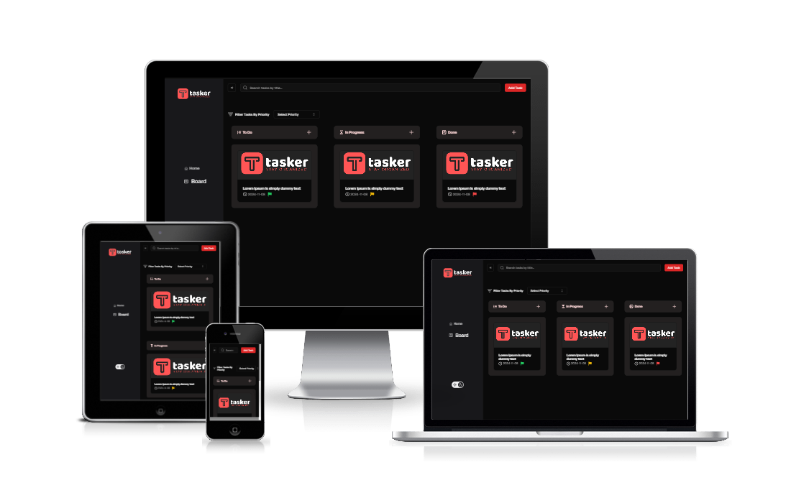

# Tasker

A simple task management app



## Table of Contents

- [Tasker](#tasker)
  - [Table of Contents](#table-of-contents)
  - [About the Project](#about-the-project)
    - [Description](#description)
    - [Preview](#preview)
    - [Built With](#built-with)
    - [Features](#features)
    - [Usability](#usability)
  - [Getting Started](#getting-started)
    - [Prerequisites](#prerequisites)
    - [Installing](#installing)
    - [Development Mode](#development-mode)
    - [Production Build](#production-build)
  - [Credits](#credits)
  - [License](#license)
  - [Demo](#demo)

## About the Project

### Description

This CRUD website is a [**Next.js**](https://nextjs.org/) app, bootstrapped with [**create-next-app**](https://github.com/vercel/next.js/tree/canary/packages/create-next-app), built with [**TypeScript**](https://www.typescriptlang.org/ "Go to website"), [**Redux Toolkit**](https://redux-toolkit.js.org/ "Go to website"), [**Tailwind CSS**](https://tailwindcss.com/ "Go to website"), and [**Shadcn UI**](https://ui.shadcn.com/ "Go to website") to customize and style the app.

### Preview

https://github.com/user-attachments/assets/5ec06d49-a330-4eec-b4ab-99c3fa62f2f6

### Built With

[](https://skillicons.dev)

### Features

- Create new task
- Edit task
- Delete task
- View task
- Kanban board
- Drag-and-drop functionality for tasks
- Search by task name
- Filter by task state and priority
- Validated form
- Light/dark mode
- Responsive web design
- Cross-browser support
- Code optimization
- Web accessibility

### Usability

All features are usable across modern desktop, tablet, and phone browsers.

## Getting Started

To get started, you need [node.js](https://nodejs.org/en "Go to website") and npm installed on your local machine.

### Prerequisites

To clone the project locally, run the following command:

```
git clone https://github.com/basma-khalil/tasker.git
```

### Installing

To install dependencies, go to the project directory and run the following command:

```
npm install
```

### Development Mode

To Runs the app in the development mode, run the following command:

```
npm run dev
```

Open [http://localhost:3000](http://localhost:3000) to view it in your browser.

### Production Build

To Build the app for production to the `.next` folder, run the following command:

```
npm run build
```

It correctly bundles Next.js in production mode and optimizes the build for the best performance.

## Credits

- **Libraries:** [ React Hook Form](https://www.react-hook-form.com/ "Go to website") |
  [Yup](https://www.npmjs.com/package/yup "Go to website")
- **Fonts:** [Geist](https://vercel.com/font "Go to website")

## License

[](https://creativecommons.org/licenses)\
This code is licensed under the **Attribution-NonCommercial-ShareAlike** License - For more details:

- [View License Deed](https://creativecommons.org/licenses/by-nc-sa/4.0/ "Go to website")
- [View Legal Code](https://creativecommons.org/licenses/by-nc-sa/4.0/legalcode "Go to website")

## Demo

For Demo of this template you can visit [bk-tasker.vercel.app](https://bk-tasker.vercel.app/ "Go to website")
